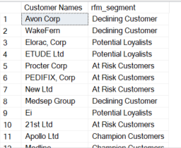

# Customer-Segmentation
The aim for this project is to segment customers. The segmentation was done based on RFM as well as K-means clustering using SQL and Python programming language.

## RFM 
RFM stand for recency,frequency and monetary
values.[Refer](https://www.techtarget.com/searchdatamanagement/definition/RFM-analysis)
- Recency: How recently a customer has made a purchase
- Frequency: How often a customer makes a purchase
- Monetary value: How much money a customer spends on purchases
RFM analysis numerically ranks a customer in each of these three categories, generally on a scale of 1 to 5 (the higher the number, the better the result). The “best” customer would receive a top score in every category.

About Data
The used dataset contained six tables:

- Customers
- Products
- Regions
- Sales Orders
- Sales Team
- Store Locations

For RFM analysis SQl was used.Calculating RFM values
~~~

SELECT
    _CustomerID,
    MAX(OrderDate) AS Last_order_date,
    (SELECT MAX(OrderDate) FROM ['Sales Orders Sheet$'] ) AS  Max_Transaction_Date,
    DATEDIFF(DD,MAX(OrderDate),(SELECT MAX(OrderDate) FROM ['Sales Orders Sheet$'])) AS Recency,
    COUNT(OrderNumber) AS Frequency,
    CAST(Sum([Unit Price] - ([Unit Price]*[Discount Applied] - [Unit Cost])) AS DECIMAL(16,2)) AS  Monetary
FROM ['Sales Orders Sheet$']
GROUP BY _CustomerID
ORDER By Frequency DESC;
~~~
Next steps required dividing these Values in segments for which NTILE window fuction is used. We need RFM scores to further divide in the segments. This can be done based on the requirements for eg. seperating based on the R,F,M values individually, Using weighted scores or combined scores. I divided custmers based on the rfm score total inot five segments.
~~~
WITH segments as
(
SELECT _CustomerID, rfm_recency,rfm_frequency,rfm_monetary,rfm_score,
		CASE
				WHEN rfm_combined >= 13  THEN 'Champion Customers'
				WHEN (rfm_combined >= 9 AND rfm_combined < 13) THEN 'Potential Loyalists'
				WHEN (rfm_combined >= 6 AND rfm_combined < 9) THEN 'At Risk Customers'
				WHEN (rfm_combined >= 4 AND rfm_combined <6) THEN 'Declining Customer'
				WHEN rfm_recency < 4 THEN 'Lost'
				END rfm_segment
FROM CS)
SELECT * INTO Analysis_cs FROM segments;
~~~
After division, using joins to get the information about customer names and sending them emails based on target campaigns can be done

Further analysis like what is the most common method our top customers use for their shopping, what locations do we need to address more, what stores need more attentions is done using joins. These queries can be refrenced [here](Customer-Segmentation\Analysis.sql)

## K-means and PCA 
K-means clustering and Principal component analysis was done using machine leaning methods in Python.
After cleaning and transforming data k-means clustering wherein data points are grouped into similar data points and discover underlying patterns.
Elbow method suggested use of 3 clusters. 
I also used PCA , although best practice would be to use it for large datasets and reduce the dimensions. Here the most important factors were 
- Component 1: Most important feature is Total Sales
- Component 2: Most important feature is Discount Applied
- Component 3: Most important feature is Recency

As a final step customers were assigned their segments

The clusters are more sprend out in PCA in comparison to k-means.

The comparisons between RFM and k means clustering were made to make obesrvations between the segmentation and it was noticed that both methods gave fairly similar results.

## Recommendations
* **Loyalists**

	- Reward: Acknowledge their loyalty with special offers, discounts, or exclusive access
	- Engage: Encourage them to become brand evangelists and early adopters of new products
	- Request Reviews: Ask for reviews or testimonials to showcase their positive experiences.
- **Lost Customers**
	- Honest Communication: Reach out to understand why they left. Address any issues or concerns
 	- Incentives: Offer personalized incentives (e.g., discounts) to encourage their return
Consistent
	- Consistent Engagement: Maintain communication to rekindle interest and loyalty2.
* **At Risk Cutomers**:
	- Personalized Messages: Send targeted emails or notifications to reconnect.
	- Identify Issues: Understand why they’re at risk and address those pain points.
	- Curate Recommendations: Provide relevant product suggestions to retain their interest.
